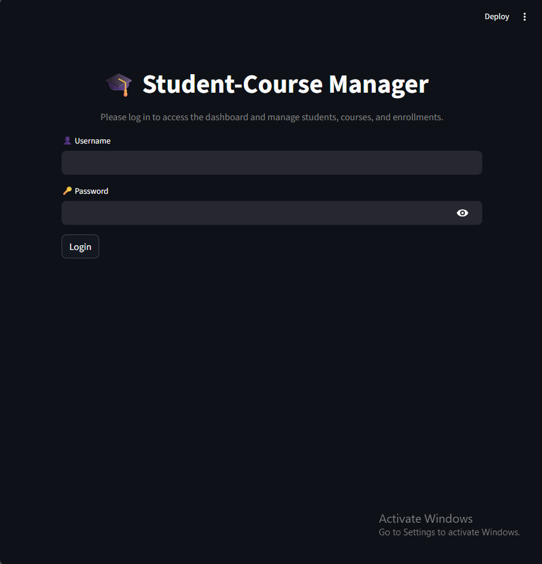
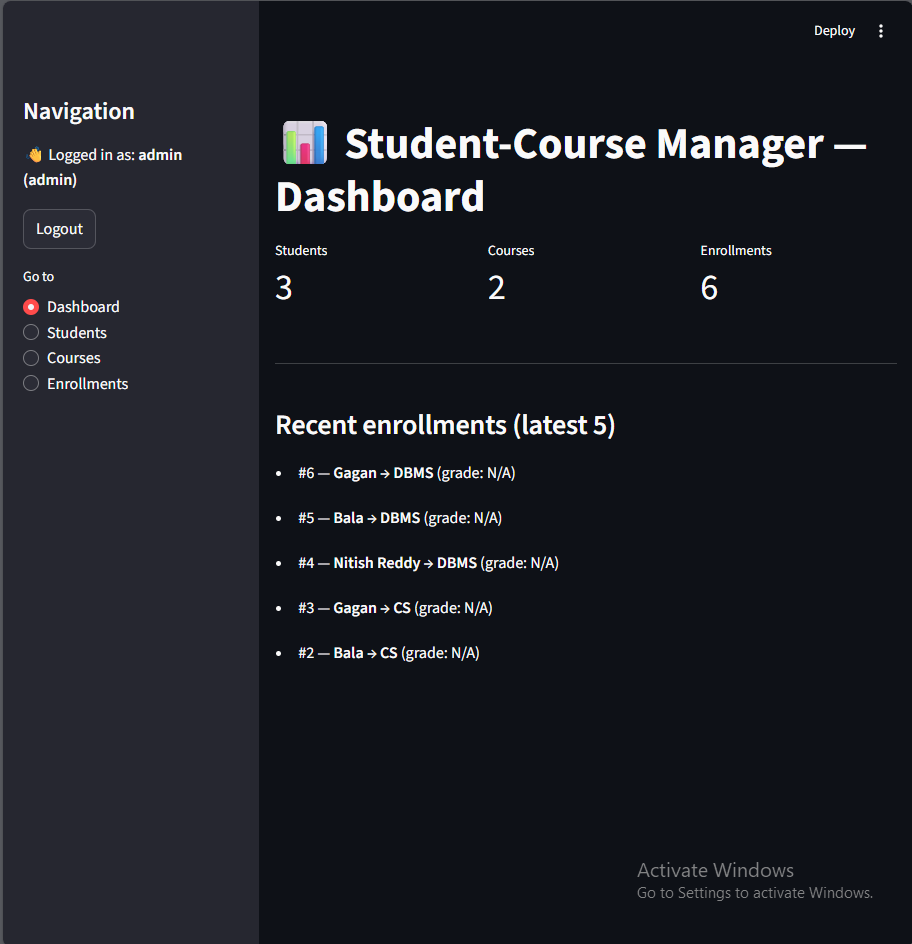
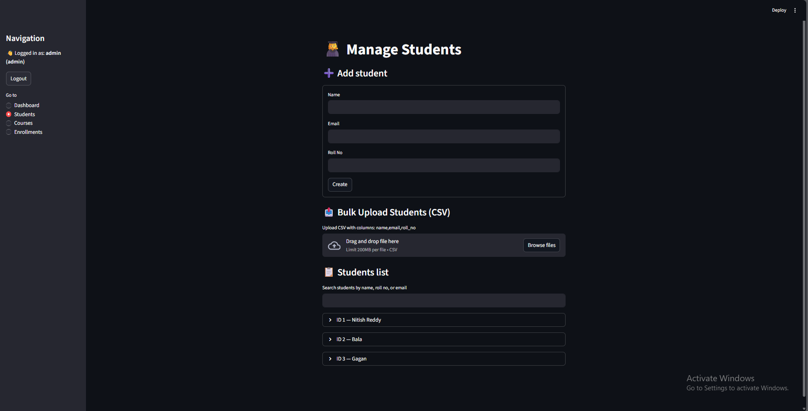
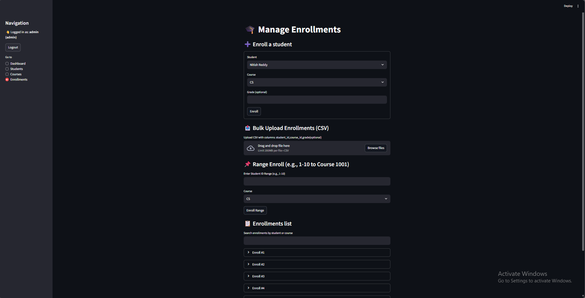

# 🎓 Student-Course Manager

A full-stack web application to manage **students, courses, and enrollments** with features for adding, updating, deleting, searching, and bulk uploads.  
Built with **FastAPI (backend)**, **SQLModel (database ORM)**, and **Streamlit (frontend UI)**.  

---

## 🚀 Features
- 👩‍🎓 Manage Students (Add, Update, Delete, Search, Bulk Upload)  
- 📘 Manage Courses (Add, Update, Delete, Search, Bulk Upload)  
- 🎓 Manage Enrollments (Enroll students, Update grades, Bulk upload, Range-based enrollment)  
- 🔎 Search functionality across Students, Courses, and Enrollments  
- 📊 Dashboard with metrics & recent activity  
- 🔐 Login with role-based access (Admin vs Viewer)  

---

## 🛠️ Tech Stack
- **Backend:** FastAPI + SQLModel + SQLite  
- **Frontend:** Streamlit  
- **Language:** Python 3.12  
- **Auth:** Simple username/password login  
- **Version Control:** Git & GitHub  

---
## 📸 Screenshots

### 🔐 Login Page

## 📊 Dashboard

### 👩‍🎓 Students Management

### 📘 Courses Management

### 🎓 Enrollments

